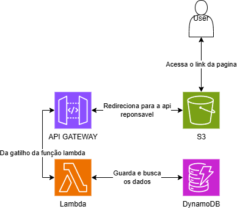
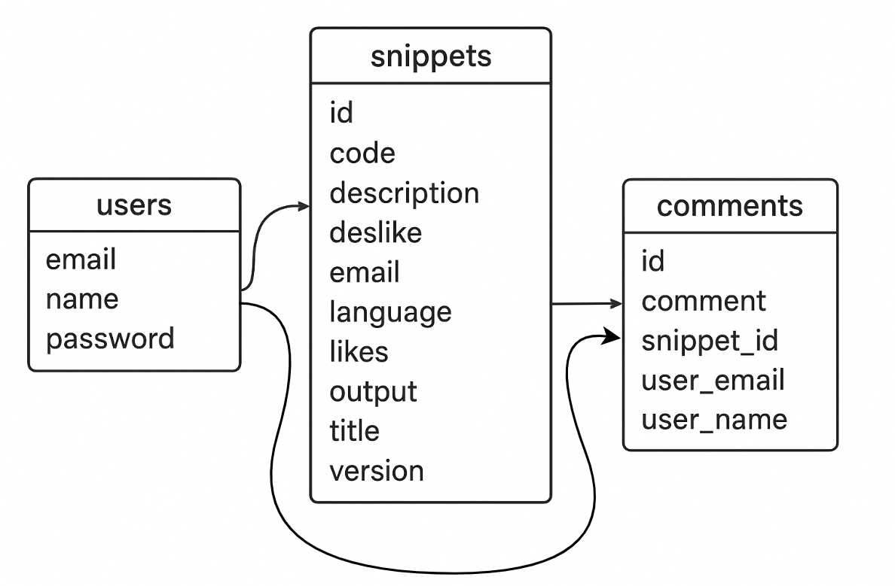
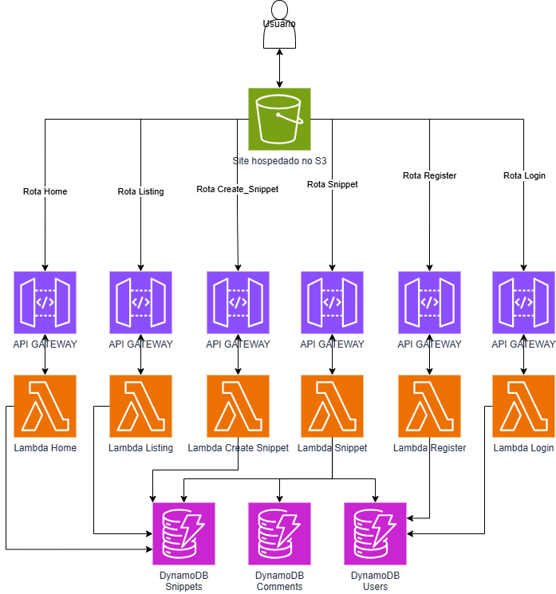

# Este é o meu projeto de conclusão de curso !
o presente projeto se divide em 2 formas, a local e a estrutura dentro da AWS, a local utiliza Flask com as rotas locais, modelos de machine learning para busca semântica, e estrutura unificada.
Já a parte da AWS está dentro da pasta AWS, onde estão as funções lambdas.

## AWS
dentro da AWS a arquitetura simplificada é esta:

ao todo existem 6 funções lambda, para cada função existe uma rota, sendo elas:
> ### Home

Esta função tem como objetivo recuperar os 3 snippets com mais likes do banco de dados, e assim retornar a página, ela é apenas POST.

> ### listing

A função listing aceita tanto POST quanto GET, quando é um GET é quando a página é aberta normalmente sem nenhum id na url, ele pega todos os snippets de dentro do banco de dados e retorna a página para popula-la.

Já o POST serve para 2 casos, quando o usuário faz um filtro vindo a HOME ou do proprio LISTING, ou quando o usuário utiliza a barra de busca, no caso da busca ele utiliza o algoritmo <b>BAG OF WORDS</b> e assim que ele tem a nova listagem montada retorna a página para popula-la.

> ### snippet

Assim como o LISTING, o snippet também tem tanto GET quanto POST, para o GET é passado pela URL um ID do snippet em especifico que deve ser buscado os dados no banco dados para assim popular a página, para o caso do POST é utilizado quando um comentário é feito no snippet, assim enviando o id do snippet, comentario, e os dados do usuario que comentou.

> ### login

Login é um formulário que tem apenas a rota POST, ele recolhe os dados e envia a lambda para fazer a autenticação do usuário.

> ### register

Register é um formulário, ele tem apenas a rota POST, o objetivo dele é pegar os dados inseridos pelo usuário e registrar um novo usuário na tabela Users.

> ### create_snippet

Create_snippet é um formulário, ele também tem apenas a rota POST, ele recolhe os dados do formulário e cria um novo registro de snippet dentro da tabela snippet.

## DynamoDB
Diagrama de tabelas do DynamoDB, ele tem 3 tabelas sendo elas, users, snippets e por fim comments.

## Arquitetura completa de rotas

